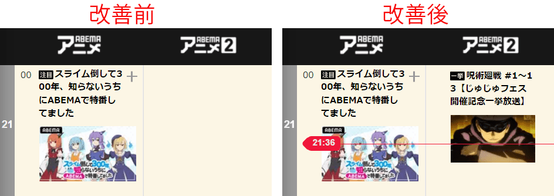

# AbemaTimetableKaizen

Abema_timetable_kaizen.user.jsはABEMAの番組表を改善するユーザースクリプトです。

主な機能として、アニメの一括放送などで縦長になった番組で上部に隠れる番組タイトルを表示させます。

Tampermonkey (Chrome)などの拡張機能をインストールした後、以下のリンクをクリックすると追加できます。

https://raw.githubusercontent.com/querykuma/AbemaTimetableKaizen/main/Abema_timetable_kaizen.user.js

## その他の改善

現在時刻のバーを常に表示させ、アニメ番組までスクロールさせ、モーダルウィンドウをクリックして閉じます。